<style>
div.footnotes {
  position: absolute;
  bottom: 0;
  margin-bottom: 20px;
  margin-left:120px;
  width: 80%;
  font-size: 0.6em;
}
</style>

<script src="https://ajax.googleapis.com/ajax/libs/jquery/3.1.1/jquery.min.js"></script>

<script>
  $(document).ready(function() {
    $('slide:not(.backdrop):not(.title-slide)').append('<div class=\"footnotes\">');

    $('footnote').each(function(index) {
      var text  = $(this).html();
      var fnNum = (index+1).toString().sup();
      $(this).html(text + fnNum);

      var footnote   = fnNum + ': ' + $(this).attr('content') + '<br/>';
      var oldContent = $(this).parents('slide').children('div.footnotes').html();
      var newContent = oldContent + footnote;
      $(this).parents('slide').children('div.footnotes').html(newContent);
    });
  });
</script>

```{r setup, include=FALSE}
knitr::opts_chunk$set(echo = FALSE,
                      message = FALSE, warning = FALSE)
```

```{r, eval=FALSE}
library(dplyr)
library(ggplot2)
library(pander)
library(magrittr)
library(reshape2)
```


## Lecture Outline

1. Introduction
2. The Development Of Transcriptomics
    - Expressed Sequence Tags
    - Quantitative PCR (qPCR)
    - Microarrays
    - RNA Seq
3. Future Directions

# Introduction

## Definition

1. **What is the transcriptome?**
2. **Why do we study the transcriptome?**

## Definition

The **transcriptome** can be defined as:

<div style="text-align:center;width:90%;color: #333333;background-color: #DDDDDD;margin-left:5%">
the complete set of transcripts in a cell, or a population of cells, for a specific developmental stage or physiological <footnote content="Wang et al RNA-Seq: a revolutionary tool for transcriptomics Nature Reviews Genetics 10, 57-63 (January 2009)">condition</footnote>
</div>

- In general this can be summarised as the RNA content of a cell
    - Includes *messenger RNA* (mRNA), *non-coding RNA* (ncRNA), *small RNA*
    - Can also include *transfer RNA* (tRNA) and *ribosomal RNA* (rRNA), but generally doesn't

## Why Study the Transcriptome?

- mRNA is the intermediary step between the genome (DNA) and proteins
- small RNA and ncRNA play significant roles in gene regulation
- Will be different in each individual cell but will share *many common and specific features within cell/tissue types*
- Is always a point-in-time snapshot of a dynamic process

## Why Study the Transcriptome?

- Is often focussed around the level of (or changes in) transcriptional activity at each locus:
    - *Gene Expression Levels*
    - Transcript usage within a locus
    - Allele specific expression - preferential expression of a parent allele
    - Expression quantitative trait loci (eQTL)
- May even discover new transcripts: *de novo* transcriptome assembly

## Why Study the Transcriptome?

- Differential Expression (DE) analysis often results in large lists of DE genes/transcripts - what next!? Biological context
    - Pathway Analysis
    - Identification of Transcription Factor binding motifs
- Make inference about the *biological processes* driving our observations
    - Targets for curing disease
    - Biomarkers for tumour detection etc.

# Background

## Recap of Transcription 

<footnote content="Image Source = http://www.web-books.com/MoBio/Free/Ch5A.htm">Canonical mRNA Processing</footnote>

```{r, fig.align='center'}
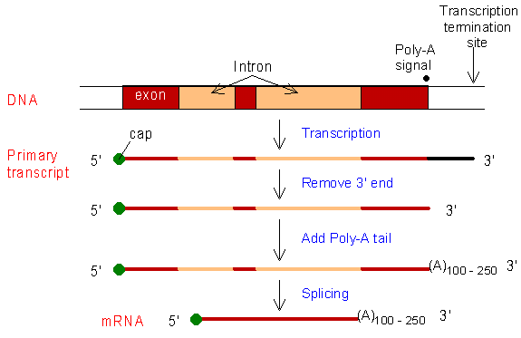
```

## Expressed Sequence Tag (EST) approaches 

The first attempt at capturing the transcriptome was in <footnote content="Adams et al Complementary DNA sequencing: expressed sequence tags and human genome project, Science 1991">1991</footnote>

- Sequenced 609 mRNA human brain mRNA sequences
- Used ESTs ~100-800bp
- ESTs were generated by reverse transcribing poly-A selected mRNA

```{r, fig.align='center'}
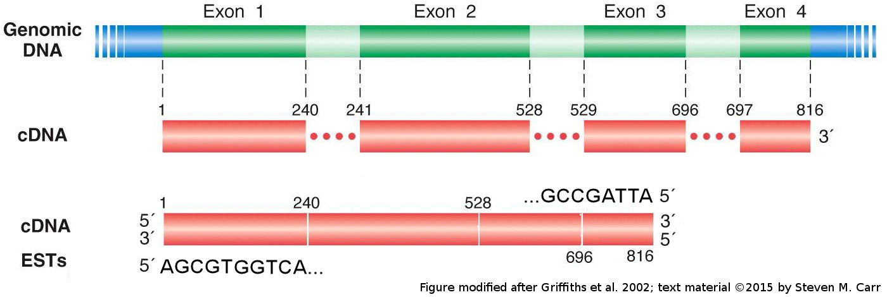
```

<!-- ## Serial Analysis of Gene Expression -->

<!-- <footnote content="Velculescu et al Serial analysis of gene expression, Science 1995">SAGE</footnote> was an important first step used to increase throughput: -->

<!-- - Conversion of mRNA to cDNA using biotinylated primers -->
<!-- - Anchored to beads -->
<!-- - Restriction Enzymes produce 11-mer tags from within a transcript -->
<!-- - Tags were concatenated before sequencing -->
<!-- - 99bp contains 9 tags, 550bp contains 50 tags etc -->

<!-- ## Serial Analysis of Gene Expression {.smaller} -->

<!-- ```{r, fig.align='center', out.height='500px'} -->
<!-- 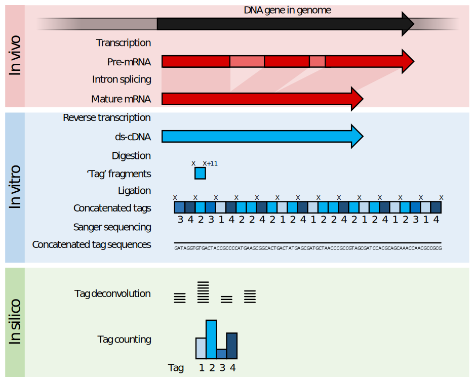 -->
<!-- ``` -->

<!-- <div style="font-size:50%;text-align:center"> -->
<!-- Image Source: Thomas Shafee; Wiki -->
<!-- </div> -->

<!-- ## Cap Analysis of Gene Expression -->

<!-- A variant technique (<footnote content="Kodzius et al CAGE: cap analysis of gene expression, Nature Methods 2006">CAGE</footnote>) -->

<!-- - Specifically targets Transcription Start Site (TSS) via the 5' cap -->
<!-- - Heavily used in FANTOM (Functional ANnoTation Of the Mammalian genome) projects -->


## Quantitative PCR

- "Gold-standard" for measurement of transcription levels
- **Not** a high-throughput technique
    - Targets a **single** transcript region with **specific** primers
    - cDNA produced is fluorescently labelled
- Measure *Cycle Threshold* (C~T~) Value
    - Is the PCR cycle that fluorescence passes a given threshold
    
## Quantative PCR

- A 10-fold dilution series

```{r, fig.align='center', out.height='480px', out.width='720px'}
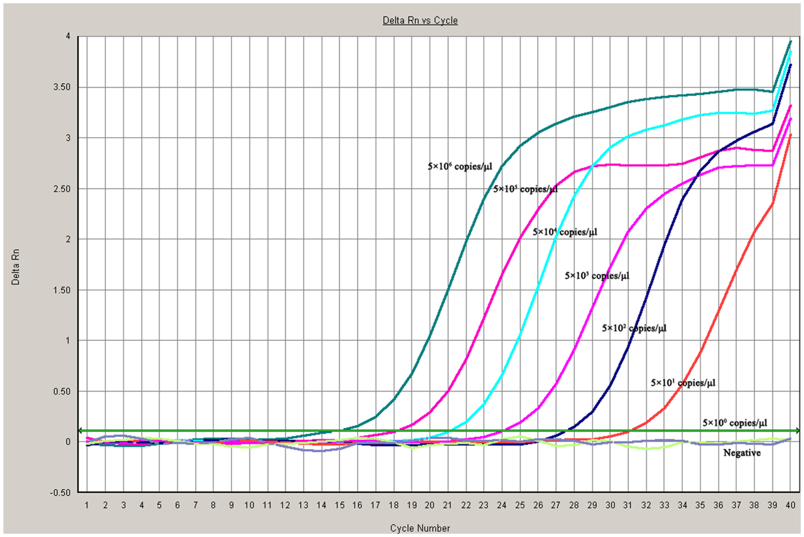
```

<div style="font-size:50%;text-align:center">
Image Source: Mingxiao et al TaqMan MGB Probe Fluorescence Real-Time Quantitative PCR for Rapid Detection of Chinese Sacbrood Virus, PLOS One 2013
</div>

## Quantative PCR

- Estimate **absolute quantity** of target
    - Using a dilution series and standard curve
- Estimate **relative quantity** of target
    - Compare C~T~ between samples

*What might be a key consideration when comparing samples?*
    
## Quantative PCR

- Estimate **absolute quantity** of target
    - Using a dilution series and standard curve
- Estimate **relative quantity** of target
    - Compare C~T~ between samples
    - Housekeeper (HK) genes are used to correct for technical artefacts (inc. pipetting variability): **Normalisation**
    
## Measuring Changes In Gene Expression

- Relative abundances are often referred to as **fold-change** (FC)
    - Down regulation is sqeezed between 0 and 1
    - Up regulation is from 1 to $infty$
    - We often use *log~2~ fold-change* get a more better scale e.g. 
      - A 2-fold up regulation in abundance $\log_2 2 = 1$ 
      - A 2-fold down regulation in abundance $\log_2 \frac{1}{2} = -1$
      - No change in abundance $\log_2 1 = 0$
    - This is often abbreviated as **logFC**
- In qPCR this value is <footnote content="Schmittgen & Livak Analyzing real-time PCR data by the comparative CT method, Nature Protocols, 2008">$\Delta\Delta C_T$ ^[^ </footnote> ^]^

## Measuring Changes In Gene Expression | $\Delta\Delta C_T$

1. First we calculate the difference in $\C~T~$ between our gene and a housekeeping gene: $\Delta C_T = C_{T[\text{gene}]} - C_{T[\text{HK}]}$ 
2. Compare the $\Delta C_T$ between samples: $\Delta\Delta C_T = - (\Delta C_{T[\text{treat}]} - \Delta C_{T[\text{control}]})$

- Assuming an amplification efficiency of 2 (i.e. **doubling of quantity for every cycle**)
    - $\Delta\Delta C_T = 1 \implies$ logFC of 
    
# Microarrays

## High Throughput Techniques {.smaller}

```{r, fig.align='center', out.height='400px', out.width='540px', fig.cap="Published papers since 1990 referring to EST (blue), Microarrays (red), RNA Seq (black) and SAGE/CAGE (yellow)"}
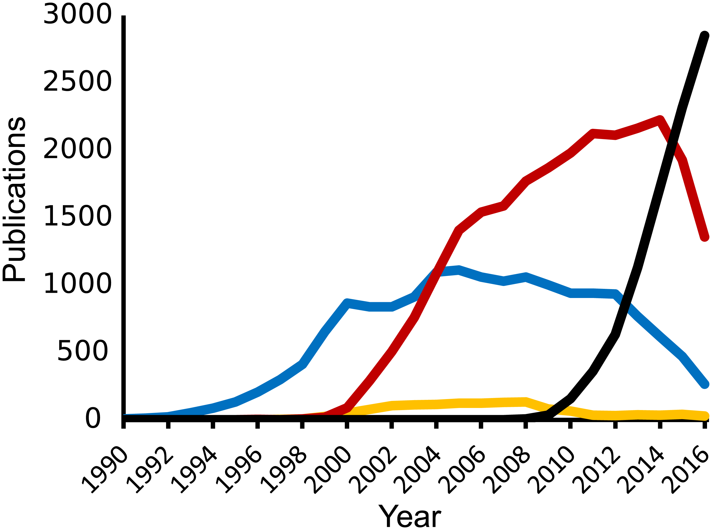
```

<div style="font-size:50%;text-align:center">
Image Source: Lowe et al Transcriptomics Technologies, PLOS Computational biology 2017
</div>

## Microarray Technology

- Marked the birth of modern transcriptomics
- Purely interested in relative abundances
- Can assess expression levels for 1000's of genes simultaneously

## Microarray Technology

```{r, fig.align='center', out.width='1000px', out.height='190px'}
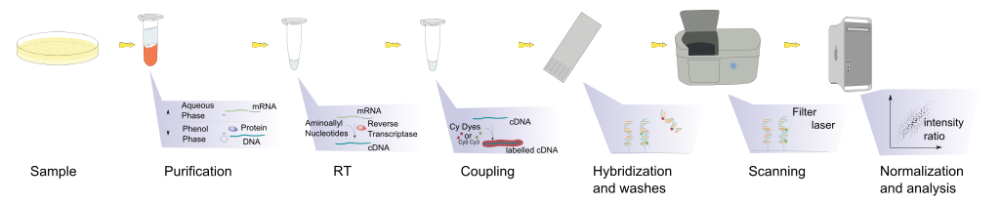
```

1. Fluorescent labelling during mRNA $\rightarrow$ cDNA
2. Complimentary probes bind target sequences (hybridisation)
3. Fluorescence detection at each probe

**The key assumption is Fluoresence $\propto$ mRNA abundance**

<div style="font-size:50%;text-align:center">
Image Source: Squidonius, Wikimedia Commons
</div>

## Two Colour Microarrays

- Probes with **known sequences** at **known locations**
    - Probes were ~65mer complimentary cDNA
    - Originally printed in local facilities
- Samples are labelled with Cy3 (Green @ 570nm) or Cy5 (Red @ 670nm)
    - Both are hybridised to array
    - Relative Red/Green intensities were of interest
    - Gave an estimate of logFC within each array

## Two Colour Microarrays     

```{r, fig.align='center', out.width='400px', out.height='450px'}
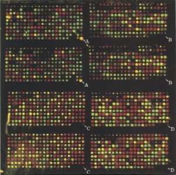
```

<div style="font-size:50%;text-align:center">
Image Source: Shalon et al A DNA Microarray System for Analyzing Complex DNA Samples Using Two-color Fluorescent Probe Hybridization, Genome Research, 1996
</div>  

## Affymetrix Microarrays | 3' Arrays

- Became the dominant arrays until RNA seq
- Single channel (colour)
- >1,000,000 25-mer probes
- Probes targetting the 3' end of transcripts - reduce issues with RNA degradation
- Usually about 11 probes per transcript (aka probeset)

## Affymetrix Microarrays 

```{r, fig.align='center', out.width='500px', out.height='440px'}
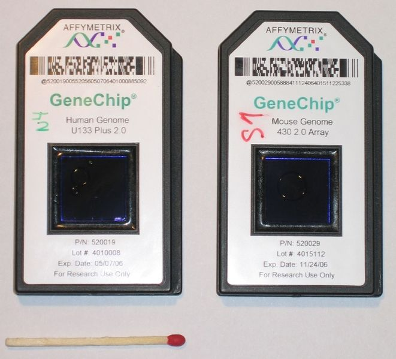
```

<div style="font-size:50%;text-align:center">
Image Source: Schulz, Wikimedia Commons
</div>  

## Affymetrix Microarrays 

```{r, fig.align='center', out.width='716px', out.height='324px'}
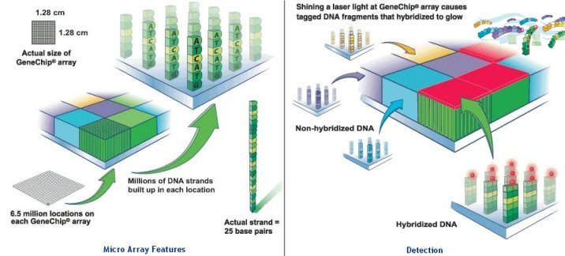
```

<div style="font-size:50%;text-align:center">
Image Source: https://universe-review.ca/R11-16-DNAsequencing.htm
</div>  


## Affymetrix Microarrays | Whole Transcript (WT) Arrays

- Exon/Gene arrays targeted the whole transcript - not just the 3' end
- $\leq$ 4 probes / exon
- No successful methods for determining alternate transcript usage
- Released in mid-2000s

## Affymetrix Microarrays 

```{r, fig.align='center', out.width='900px', out.height='405px'}
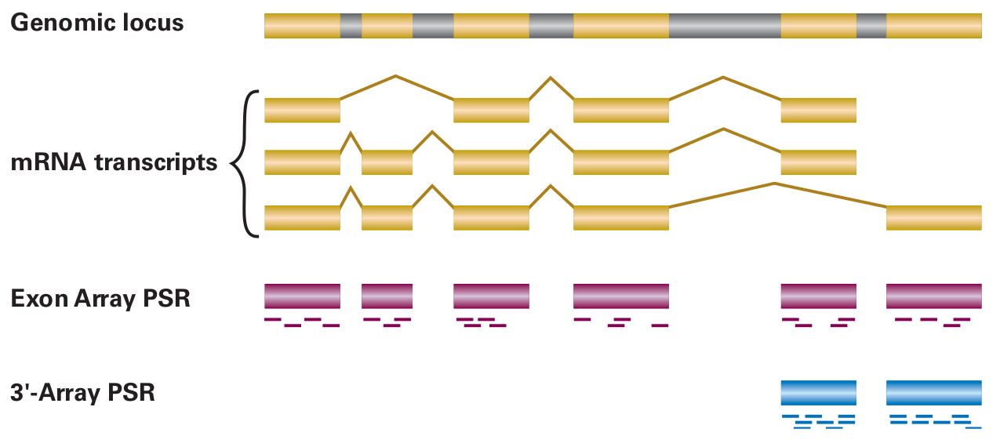
```

<div style="font-size:50%;text-align:center">
Image Source: Affymetrix Technical Note
</div>  

---

```{r, fig.align='center', out.height='400px', out.width='540px', fig.cap="Published papers since 1990 referring to EST (blue), Microarrays (red), RNA Seq (black) and SAGE/CAGE (yellow)"}

```

<div style="font-size:50%;text-align:center">
Image Source: Lowe et al Transcriptomics Technologies, PLOS Computational biology 2017
</div>

## Illumina Arrays

- Illumina produced a microarray of 50-mer probes using barcoded beads
    - Multiple beads per gene $\implies$ randomly distributed across the array
    - Dealt with spatial artefacts more effectively

```{r, fig.align='center', out.height='280px',out.width='430px'}
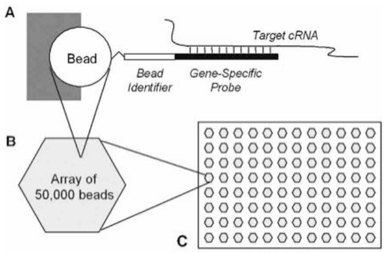
```

<div style="font-size:50%;text-align:center">
Image Source: https://bioconductor.org/help/course-materials/2007/BioC2007/labs/beadarray/BioC2007_beadarray_slides.pdf
</div>

## Illumina Arrays | Methylation

- Still heavily used in methylation analysis (Illumina 450k and EpiC arrays)
- Sample is bi-sulphite treated prior to hybridisation 
    - Converts unmethylated C to T (i.e Uracil)
- Probes for unmethylated (C $\rightarrow$ T) and methylated (C $\rightarrow$ C) sequences
- We compare proportions of methylated signal
- Target >450,000 genomic CpG dinucleotides

# Analysis Of Microarray Data

##  Single Channel Data

Two Initial Problems to solve

1. Adjust for overall differences in signal
    - Normalisation
2. Removal of Background Signal (non-specific binding + optical noise)
    - Background Correction
    
## Normalisation

- We need the exact same amount of sample on each array
    - If one sample had more material hybridised, all genes would appear upregulated
    - In qPCR we used a 'housekeeper gene'
- Can be performed *in silico* by adjusting probe intensities directly
- Quantile Normalisation is the most robust

## Normalisation

```{r, fig.align='center', out.height='85%'}
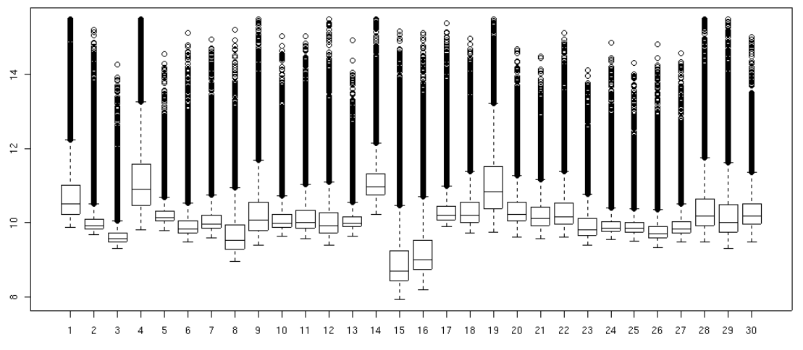
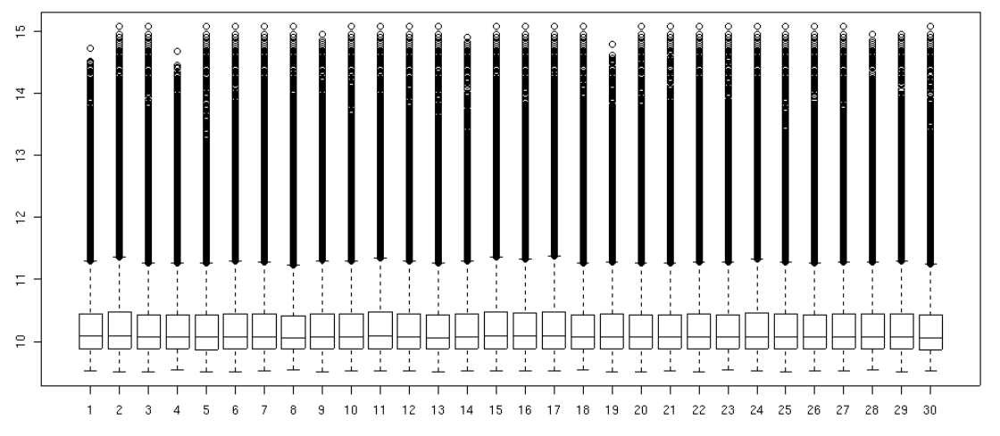
```

<div style="font-size:50%;text-align:center">
Image Source: Bolstad, Probe Level Quantile Normalization for High Density Oligonucleotide Array Data Unpublished Manuscript, 2001
</div>

## Quantile Normalisation

1. Find the probe with the lowest signal on each array
2. Give each lowest signal' probe the average of all 'lowest signal' probes
3. Find the probe with the second lowest signal on each array
4. Repeat until all probes have been given new values

## Quantile Normalisation

- Final result is identical intensity distributions on all arrays
- Equivalent to having identical amounts of source material (mRNA)
- The lowest probe on each array will probably target a different gene

## BG Correction

- Can be performed without using probe sequence information (Robust Multichip Average; RMA)
- Or by using probe sequence information (GC-RMA)
- Illumina arrays (50-mer probes) are less prone to non-specific binding than Affymetrix arrays (25-mer probes) 

## Analysis

- After BG correction (RMA), we have an estimate of true signal for **each probe**
- $\geq 11$ probes *per gene* (or transcript) per array
- A **single estimate of expression** is obtained by averaging probe signals within each array/sample

## Analysis

- Gives a continuous value: Assume Normality
- We then fit standard linear regression models for each gene
    - Or perform simple $t$-tests to obtain a $p$-value
    - $H_0$: No difference in average gene expression levels
    - $H_A$: Some difference in average gene expression levels
    
## Multiple Comparisons

- We will perform 15-25,000 hypothesis tests
     - 25,000 genes where $H_0$ is true would give ~ 1250 $p < 0.05$
     
## The Bonferroni Adjusment

- If we set the rejection value to $\alpha* = \frac{\alpha}{m}$ we control the FWER at the level $\alpha$
- To ensure that $p$(one or more Type I errors) = 0.05 in our example:<br><br>$\implies$ Reject $H_0$ if $p < \frac{0.05}{25000} = 2 \times 10^6$
- Controlling the FWER (Bonferroni) may often be too strict
    - Leads to a high Type II error rate (false negatives)


## The False Discovery Rate

- An alternative is to allow a small number of Type I Errors in our results $\implies$ we have a False Discovery Rate (FDR)
- Instead of controlling the FWER at $\alpha = 0.05$, we control the FDR at $\alpha = 0.05$:
    - We allow up to 5% of our list to be Type I Errors
    - Can perform downstream inference assuming that the signal will dominate the noise

## Microarray Summary

- Probe intensities are considered continuous variables
- We can assume normally distributed data

<!-- TODO: Add more points -->

# RNA Seq

## Fundamental Differences

- Microarray:
    - Probes designed with *a prior* knowledge of target sequences
    - Give a fluorescence intensity $\propto$ expression level
- RNA-seq:
    - Contains specific sequence information
    - We **count** amplified fragments from source material
    - Can detect/quantify novel/unknown sequences
    - Can *de novo* assemble a transcriptome: novel transcripts
    - Possibility of detecting alternate isoform usage

## Common Types of RNA Seq Libraries

- poly-A enriched (mRNA is extracted)
    - Will contain intact mRNA only (and ncRNA with polyA tail)
- Total RNA libraries (rRNA is reduced)
    - Will include ncRNA, pre-mRNA, partially degraded RNA
- small RNA libraries 
    - Targets micro RNA (miRNA), piwi-interacting RNA (piRNA), etc.

## Outline of Analysis Workflow

1. Clean up raw reads
2. Align to genome or transcriptome
3. Count

## Counting

Are we interested in activity at a locus:

- Summarise all reads to a gene $\implies$ Differentially expressed genes

Are we interested in transcript-level information

- How do we count reads now? Reads can align to multiple transcripts
- Do we summarise splice junctions?
- Is alternate isoform usage the same as differential expression?

## Counting

```{r, fig.align='center', out.width='750px', out.height='400px'}
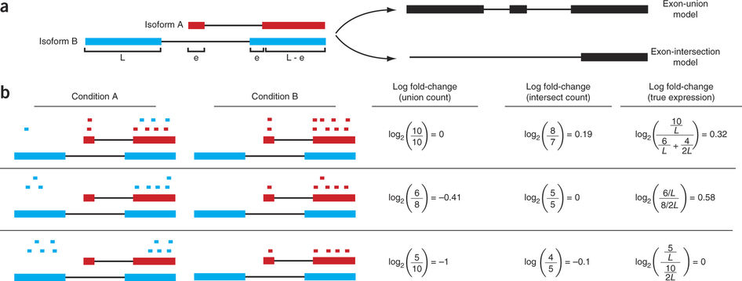
```

<div style="font-size:50%;text-align:center">
Image Source: Trapnell et al Differential analysis of gene regulation at transcript resolution with RNA-seq, Nature Biotech, 2013
</div>

## Differential Gene Expression

- Treating each gene as summarised by locus
- Highly analogous to microarray analysis
    - Except this is count data
    - Not Normally distributed
    
## Differential Gene Expression

- Counts are traditionally modelled using the Poisson Distribution
    - This models a rate of occurrence per fixed unit
- Poisson $(\lambda)$ has mean = variance = $\lambda$
- What if our observed variance is greater than the mean?
    - The model is inappropriate

## Differential Gene Expression

- Gene counts can be modelled as Negative Binomial data
    - Just like Poisson, except has an 'dispersion' parameter for when variance differs from the mean
    - We use this to model greater variability than the Poisson would allow
- Instead of $T$-tests:
    - Exact Test (Robinson & Smyth) for comparison of two groups, or;
    - Generalised Linear Models
    
# Bonus Material
    
## Normalisation

- Counts are directly impacted by library size
    - Smaller libraries will have lower counts
- In contrast to microarrays, we do not directly adjust our counts
    - Include a term in models
    - `dgeList$samples$norm.factors`
    
## Other Considerations

- Do we need to account for Type I errors? $\implies$ FDR
- Can we fit moderated $T$ statistics?
- Can we down-weight samples

## The voom transformation

```{r, out.height='450px',out.width='600px',fig.align='center'}
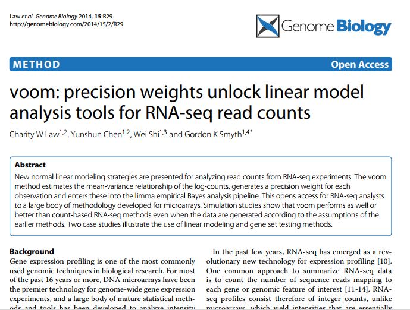
```

## The voom transformation

- This transforms negative binomial counts into continuous data
- Enables the assumption of Normality
- All microarray techniques are back in play!
    - Moderated $T$-tests
    - Weighted Regression
    
## Downstream Analysis

What happens after we have a list of DE genes?

## Downstream Analysis

What happens after we have a list of DE genes?

- Do we integrate our data with methylomic analysis?
- Is there co-expression in Topologically Associated Domains?
- Do we look for genes with high correlations $\implies$ look for common TF binding sites in promoters?

## Downstream Analysis

We can test for enrichment of pre-defined gene sets in our data:

- Gene Ontology (GO); 
- Kyoto Encyclopaedia of Genes & Genomes (KEGG) pathways
- Reactome pathways

## GO Enrichment Analysis

Most common approach is Fisher's Exact Test

|          |  In Pathway  | Not In Pathway |
| -------- | ------------ | -------------- |
| DE Genes |    50        |    150         |
| Controls |  100         |   15000        |

Choosing suitable control/background genes is very important


# Future Directions Of Transcriptomics

## Differential Transcript Usage

- Counting alignments become important
- Kallisto aligns to transcriptome using $k$-mers
    - Produce pseudo-alignments, or list of possible transcripts a read can align to
    - Deals with multi-mapping problems
- Algorithms for analysis are far from settled!!!

## Differential Transcript Usage

- At the gene/locus level length is constant across treatment groups
- Under DTU, this assumption is no longer valid
    - Algorithms which use this show clear out-performance
    
An excellent talk/paper is:

*Differential analyses for RNA-seq: transcript-level estimates improve gene-level inferences
Charlotte Soneson, Michael I. Love, and Mark D. Robinson*


## Long Reads

- Pac-Bio Long reads will be better at correctly identifying transcripts
- Still too expensive for large scale quantitation

## Single Cell RNA Seq

- All previous approaches have worked with a pool of starting cells
- Single Cell approaches are now appearing
