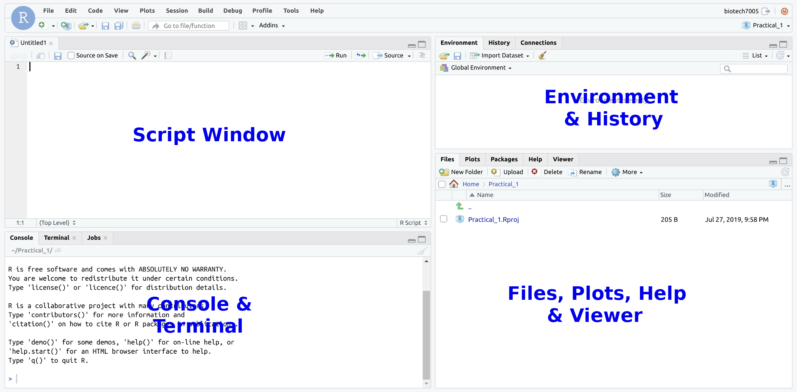
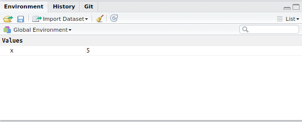

```{r, echo = FALSE}
library(knitr)
opts_chunk$set(echo = TRUE,
               eval = FALSE,
               message = FALSE, warnings=  FALSE)
```


# Introduction

## Introduction to R

### What is R?

- R is an interactive programming language/environment in which code can be executed in real-time, or run as a stand-alone script
    - Can be run on an HPC, a Virtual Machine (VM) or locally (on your laptop)
    - Can be run from the terminal (Mac/Linux), stand-alone (Windows) or inside an Integrated Development Environment (IDE) on all platforms
- Grew from the statistical language `S` (Bell Labs, 1976)
    - Redesigned in 1992 by Ross Ihaka & Robert Gentleman
- One of the most widely used languages in biological research
    - Also very heavily used across all data science disciplines
    - Commonly requested skill for many job opportunities

### Why use R?

R offers considerable advantages over Excel, GraphPad Prism & the like:  

- Complex, informative and visually-pleasing plots can be made
- We can handle extremely large datasets  
- Complex analytic procedures become simple
    - Many processes/workflows have been defined as functions 
    
Importantly: **We have code to record and repeat our analysis.**
This enables highly reproducible (and reputable) research!


### How do we use R

`R` can be installed on any laptop and the most common method for interacting with R is the IDE known as **RStudio**.
When using RStudio, we can think of RStudio as being like the cabin of a car, whilst `R` itself is the engine.
RStudio has a whole of extra features not directly related to `R`, but that make our experience much more enjoyable whilst working with `R`.

For these practicals we have given you a Virtual Machine (VM) and we will use these to ensure minimal issues with the entire practical series.
RStudio is how we will primarily interact with our VMs

**Please [go here](../vm_connection) for instructions on connecting to your VM.**


## Using R

Let's have a quick look at R in it's simplest form.
To make a calculation or run a command directly, we can us the `Console`.
In the top left corner, directly below the blue 'R' logo, you can see the word `Console`.
Click this and you should see the following text:

```
R version 3.6.1 (2019-07-05) -- "Action of the Toes"
Copyright (C) 2019 The R Foundation for Statistical Computing
Platform: x86_64-pc-linux-gnu (64-bit)

R is free software and comes with ABSOLUTELY NO WARRANTY.
You are welcome to redistribute it under certain conditions.
Type 'license()' or 'licence()' for distribution details.

R is a collaborative project with many contributors.
Type 'contributors()' for more information and
'citation()' on how to cite R or R packages in publications.

Type 'demo()' for some demos, 'help()' for on-line help, or
'help.start()' for an HTML browser interface to help.
Type 'q()' to quit R.
```

Directly below this you'll see a flashing cursor next to the following symbol.
```
>
```

(If the cursor is not flashing, click on this pane and it should start flashing.)

This is the `R` Console and this symbol is the prompt within an R session.
We enter our code here, and can even use this as a simple calculator.
Enter the following at the R prompt followed by <kbd>Enter</kbd> after each line, which will evaluate our 'difficult' calculations.

```{r, eval = FALSE}
1 + 1
2 * 2
1 / 4
3 ^ 2
```

Mess around with a few more simple calculations, then move on to the next section.

## R Studio

In the simple exercise above, we interacted directly with the R Console, but most of the time we will use the R Studio Integrated Development Environment (IDE).
As you're probably aware, this is how we've logged into our VM and this will be our main environment for the practical series.

Both R and R Studio as also able to be installed on your own computer, and you may need to do this outside of this course.
However, *it will not be required for this course.*

### Starting with R Studio: Creating an `R Project`

First we will set up an `R Project` for today's practical.
These are a simple way of managing your code for multiple analyses or datasets, and *are always named after the directory they are in*.
These are not essential, but are very useful and make good practice.
If you don't follow this step, you will be making your life immeasurably harder and will not be following 'best practice' for R.

In the middle of the screen you will see the home icon (![images/home.png]).
Click on ![images/NewFolder.png] directly above this and call this folder `Practical_1`.
**Please ensure you spell this correctly, including the underscore and capitalised first letter**

This is where we'll run everything for today's session.
To make an R Project for this folder use the following commands in the menu bar at the top of your R Studio session:

1. `File` > `New Project` 
2. When asked if you'd like to `Save Current Workspace`, choose `Don't Save`.
3. Choose `Existing Directory` >
    + Browse to `Practical_1`
    + `Create Project`

You will now find yourself in this folder we have created.
If you look at the top right of your RStudio session you will also see `Practical_1` and an arrow for the drop-down menu.
We only have one project at this point, but this is where you can switch between projects.
For this practical series, we'll start a new project for every session.
This will help you keep everything organised so you can find everything later.
Managing your data and code intelligently is a considerable challenge in bioinformatics.


### Starting with R Studio: Creating an `R Script`

Instead of just entering commands into the console, we can enter our commands into a text file, known as a *script*, and execute them from this file.
This enables us to keep a complete record of everything we have done in complex analyses.
Sometimes, we even publish these are part of a research paper.

Let's create a blank `R Script`.
As you may expect, these are just plain text files we use to save our code.
Using the RStudio menu:

```
File > New File > R Script
```

Save this as `Introduction.R`.

Your screen should now look like the following (without the blue text):

```{r, echo = FALSE, include=TRUE, eval = TRUE, results='asis', fig.show='asis', out.width=900, fig.cap="The common RStudio layout"}

```

Let's take a tour through the various panes and tools within RStudio. 

### The Script Window

- This is just a plain text editor.
- We enter our commands here but they are not executed
    - We can keep a record of __everything__ we've done
    - We can also add comments to our code
    - Comments start with the `#` symbol
- We'll return here later

### The R Console

- Where we can execute commands directly, as we've already seen
- This is essentially the _engine_
- In recent versions of RStudio we also have a `Terminal` which we have already used to change our password. We'll also spend a fair bit of time here later in the course.

As well as performing simple calculations in the Console, as we've already done:

- `R` has what we call an `Environment` (i.e. a Workspace)
- We can define objects here, or import data
   - These are like a worksheet in Excel, but **much more** flexible & powerful
   - `R` objects are also similar to variables in many other programming languages
- `R` performs calculations & runs processes on these objects.

To create an `R` object:

- We need to give it a name, and some data, just like we create a Spreadsheet in Excel, name it and start entering data.
- In `R`, the process looks like `nameOfObject <- data`
    - The `<-` symbol is like an arrow
    - Tells `R` to put the `data` in the object

In the Console type:

```{r}
x <- 5
```

- We have just defined an object called `x`
- View the contents of the object `x` by entering it's name directly in the `Console`, or by calling `print()`

```{r, echo=TRUE, include=TRUE, results='hide'}
x
print(x)
```

**Where have we created the object `x`?**

- Is it on your hard drive somewhere?
- Is it in a file somewhere?


<details><summary><b>Answers</b></summary>
The object is in our R Workspace (or Environment).
We can save our R Environment if we wish to keep all of our objects.
Generally in R, we don't as we instead keep our code for generating, or working with these objects.
</details>  

### The R Environment

We have placed `x` in our `R Workspace`, which is more formally known as your `Global Environment`.

```{r, echo=FALSE, include=TRUE, eval = TRUE, out.width=600}

```

The `Environment` pane shows us which objects are currently in our R Environment.
The `Environment` is very much like the desk in your study (or bedroom) where we can have things spread and piled up everywhere.
In the R Environment, we can create objects of multiple types.
Once an object is in our `Environment` we can perform calculations on it.
Using the object `x` we created as an example:

```{r}
1 + x
x^2
```

**NB: R is *case sensitive**

#### Functions

`R` has a series of in-built functions, e.g. `sqrt()`, `log()`, `max()`, `min()` etc. loaded into your Environment.
We place an object or value inside the `()` after the name of a function

```{r}
sqrt(x)
log(x)
```

Many in-built functions are organised into a package called `base`

- Always installed with `R`
- Packages group similar/related functions together

### The Help Pane

In the Console type `?base` + <kbd>Enter</kbd>
This will take you to the `Help` pane.
Click on the underlined word `Index` at the bottom for a list of functions in the `base` packages.
We can also search for help with any function by starting with a question mark in the `Console`.
For another example, we could try `?sqrt`

Also in the pane are the `Files` and `Plots` panes.
We've already used the `Files` pane to create our Practical_1 folder.
Whenever will plot anything in a script, or in the R Console, the figures will appear in the `Plots` pane in this section of RStudio.

If we generate any html output, this will appear in the `Viewer` pane.
However, the Packages pane is quite useless and slightly dangerous for the unwary.
In R, we never click on anything and this pane will tempt you into bad habits.
We usually have this disabled as it serves literally no purpose.

<details><summary><b>How to disable the Packages pane</b></summary>
If you'd like to do this, using the RStudio menu bar select `Tools > Global Options > Packages`, then uncheck the box next to `Enable packages pane`.
</details>  


## Writing Code In The Script Window

Best practice for all analysis is to enter every line of code in the Script Window

- This is a plain text editor $\implies$ `RStudio` will:
    - highlight syntax for us
    - help manage indenting
    - enable auto-completion (it's a bit slow sometimes though)
- Enter code in this window and *send it to the R Console*    
- We save this file as a record of what we've done

When writing code

- We can write comments by starting a line with the `#`
    - Anything following this symbol will not be executed
    - Can write notes to ourselves and collaborators
    - We can also place `#` at the end of a line with a comment following

To see how this works:

- Enter the following in the Script Window (but don't do anything else)

```{r}
# Create an object called x
x <- 1:5
```

To send this to the Console:

- Place the cursor on a line then `Ctrl+Enter` (`Cmd+Enter` on OSX), or
- Select the lines using the mouse then `Ctrl+Enter` (`Cmd+Enter` on OSX)
- Or after selecting the line(s) you can click the `Run` button

As well as creating objects, we can use this to write general code.
Enter the following in your script, then send it to the R Console.

```{r}
# What do we have in the object `x`
print(x)
```

In `R`, this type of object is known as a vector, and this is quite similar to a single column in Excel.
We can perform operations on an entire vector.
Again, type this into your script window, then send it to the Console

```{r}
# I'm not sure. Which values are greater than one?
x > 1
```

As well as logical test, we can perform mathematical operations on a vector.

```{r}
# Let's square every value in `x`
x^2
# And we can find the square root of every value
sqrt(x)
```

We'll learn more about vectors later.

### Other Features of RStudio

#### Tab Auto-completion

`RStudio` will give us suggestions when we ask it to.

- In either the Console or Script Window type `?bas` then wait for about half a second
    - A whole lot of options will appear
    - Very handy with long variable/function names
    - If you can't quite remember the spelling
    - Can sometimes (inappropriately) complete when you don't want it to

#### The History Tab

- Next to the `Environment` Tab is the `History` Tab
    - Contains everything executed in the `Console`
    - Useful for when we've been lazy
- Best coding practice is to **enter code in the `Script Window` and execute**

#### Resizing Windows

- Every tab can also be resized using the buttons in the top right
- Window separators can also be be moved

```{r, echo=FALSE, eval=TRUE}
opts_chunk$set(include = TRUE,
               eval = TRUE,
               fig.show = 'asis')
```

