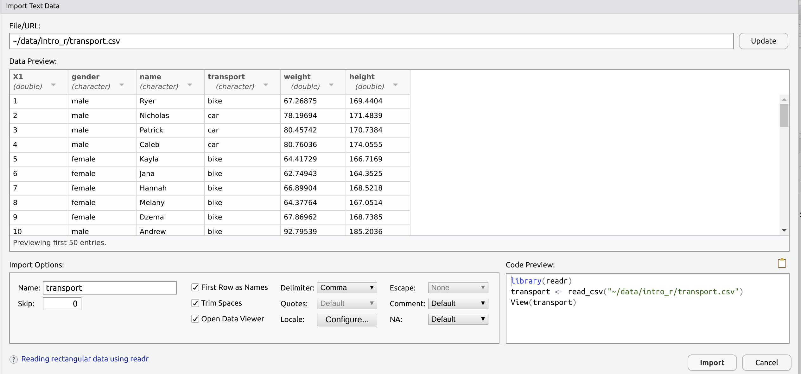

```{r, echo = FALSE}
library(knitr)
opts_chunk$set(
  echo = TRUE,
  eval = TRUE,
  message = FALSE, 
  warnings =  FALSE
)
```


## Working With Data In R

As well as forming objects like we did in the introductory session, we often import pre-existing data into R from a spreadsheet, and use this to perform an analysis.
Sometimes we have to manipulate & 'wrangle' the data a little and as part of this.
We also make plots to see what everything looks like as a common part of this process.

Today we'll start the ball rolling and will introduce a set of packages known as the `tidyverse`.
This is a core set of packages produced by the RStudio team which make working with data as painless as possible.
A brief introduction to these packages and the general approach is summarised below.


### Importing Data

Like most programming languages `R` is very strict about data formats.
We can import `.xlsx`, `xls`, `csv`, `txt`, `gtf/gff` files + many more file types, but understanding the structure of the imported data is often required.
For Excel files, some things we do to make it "look nice" can create problems, or are just ignored:

- Merged cells can lead to errors and unexpected results
- Specifying missing values can give misleading values
- Blank rows are not fatal, just annoying
- Cell formatting such as colour, fonts and cell-size will not be imported
- Plots will not be imported

**Before We Go On**

We first need to create a new script for this section.
Save and close the first script we used, then create a new one

1. `File` > `New File` > `R Script` (Or `Ctrl+Shift+N`)
2. Save as `DataImport.R`
3. Enter this line at the top of the script

```{r}
library(tidyverse)
```

Once you've entered this in your script, send it to the console using one of the methods we introduced earlier.
This will load several packages which contains many useful functions for the following section.
You should see something like the following, which tells us which individual packages have been loaded

```
── Attaching packages ─────────────────────────────────────────────────────────────── tidyverse 1.2.1 ──
✔ ggplot2 3.2.0     ✔ purrr   0.3.2
✔ tibble  2.1.3     ✔ dplyr   0.8.3
✔ tidyr   0.8.3     ✔ stringr 1.4.0
✔ readr   1.3.1     ✔ forcats 0.4.0
── Conflicts ────────────────────────────────────────────────────────────────── tidyverse_conflicts() ──
✖ dplyr::filter() masks stats::filter()
✖ dplyr::lag()    masks stats::lag()
```

This strategy of loading pacages at the start of your script using the command `library(packageName)`, is a best practice commonly used by R programmers.
This will be helpful for any collaborators, and for yourself when you look back at a script in 6 months.


#### Using the GUI To Load Data

Now we've gone through some formalities, let's import some data using the Graphical User Interface (GUI) that comes with RStudio

1. Navigate to your `~/data/intro_r` folder using the `Files` Tab.
    - First click the  icon then click into `data`.then `intro_r`
2. Click on the file `transport.csv`
3. Select `View File`

This can be used to open (small) files in the `Script Window` and view them as plain text files.
When doing this **the file is not loaded into R**.
However, it can be useful just to have a quick look at what the file contains.
Here we can see that we have a series of comma-separaed entries, which is what we expect for a `.csv` file.

Now close the file again by clicking the cross next to the file name in the Script Window.

To import the file, or more accurately, to import the data within the file into our `R Environment` we can either:

1. Click on the file and choose `Import Dataset`, or
2. Use the button as shown in the `Environment` Tab


Let's use the first of these methods, so click on the file and choose `Import Dataset`.
This will open the **Preview Window** as seen below.
(If `Data Preview` is empty, click on the `Update` button.)




As highlighted in the circle below, this gives us a preview of the data as `R` will see it.
This is helpful to check that the columns are as we expect.
If there are problems with delimiters (sometimes files can be labelled `.csv` files but use a tab or semi-colon as delimiters) we will spot the problem here.
If the column names are not as expected, we can also spot any problems here.

```{r, echo=FALSE, out.width='900mm', fig.align='center', fig.cap = "The Preview Window showing where we can see a preview of the data."}
knitr::include_graphics("images/importGUI_preview.png")
```

**A very important frame in this preview is the code highlighted in the bottom right corner.**
This is the `R` code that is being executed to import the data.
**Highlight this code with your mouse/touchpad and copy it to your clipboard.**

```{r, echo=FALSE, out.width='900mm', fig.align='center'}
knitr::include_graphics("images/importGUI_code.png")
```

Once you have copied this code, click `Import` and the data will pop open inside `RStudio`.
**Before you go any further, go to your `DataImport.R` script and paste the code directly below the line** `library(tidyverse)`.

### Undertanding the Executed Code

The code we copied has 3 lines:

1. `library(readr)`
    + The package `readr` contains the function `read_csv()`
    + We have already loaded this package when we entered `library(tidyverse)`, so this line is a little redundant but won't hurt to include.
    Reloading a package generally does nothing.
2. `transport <- read_csv("~/data/intro_r/transport.csv")`
    + This is the code executed to load the data into your `R Environment`
    + It created an object named `transport` by using the file name without the suffix. (`transport <-`)
    + The location of the file on your hard drive was passed to the function `read_csv()`
    + The function `read_csv()` was then used to parse the plain text into the `R Environment`
3. `View(transport)` opened a preview in a familiar `Excel-like` format
    + *We never use this in the Bioinformatics Hub*
    + Edits in here will not affect the main `R` object, and only affect this preview 
    + Close the preview by clicking the cross next to `transport` in the `Script Window`
    + Delete `View(transport)` from your pasted code

We have just loaded data using the default settings of `read_csv()`.
(If we'd change any options in the GUI, the code would have changed.)
**Now we've saved the code in our script, we no longer have any need the GUI to perform this operation again.**

<details><summary><b>The `~ symbol</b></summary>
You may have seen the `~` symbol in the code above.
This is MacOS and Linux shorthand for your home directory.
We'll cover this in more details once we get to our Bash Practicals, but is shorthand for the directory `/home/biotech7005` on your VM.
</details>

To demonstrate this:

1. In the `Environment Tab` click the broom icon ()
    + This will delete everything from your `R Environment`
    + It won't unload the packages loaded by `tidyverse` 
2. Select the code we've just pasted and run it all again
3. Check the `Environment Tab` again and `transport` is back!

This idea is at the very heart of **Reproducible Research!!!**

### Understanding `read_csv()`

In the above we called the `R` function `read_csv()`.
To find out how the function works, we can check the help page by typing a `?` followed by the function name (no spaces)

```{r, eval = FALSE}
?read_csv
```

This page lists four functions, but stick to `read_csv()`
This function has numerous arguments given with names like `file`, `col_names` etc.

- If just the name is given in the function (e.g. `file`), we need to specify something or the function will not know what to do
- For any *argument* which is given a default value (e.g. `col_names = TRUE`), the function has a default value and we don't need to specify anything, unless over-riding the defaults, or wishing to be explicit for anyone reading our code.
- **If specifying arguments in order, we don't need to name them**
- All `arguments` for the function were defined somewhere in the GUI

For example:

```{r, eval=FALSE}
transport <- read_csv("~/data/intro_r/transport.csv")
```

Is equivalent to:

```{r, eval=FALSE}
transport <- read_csv(file = "~/data/intro_r/transport.csv")
```

#### Questions

<details><summary><b>If we had a file with 3 blank lines to start, what could our code look like?</b></summary>
Setting the argument `skip = 3` would then tell `read_csv()` to ignore the first 3 lines.

```{r, eval=FALSE}
transport <- read_csv("path/to/file", skip = 3)
```

</details>

<details><summary><b>The `read_csv()` function can take an argument `trim_ws`. What do you think the argument `trim_ws` does?</b></summary>
Removes whitespace at the start/end of any fields.
</details>

```{r, echo = FALSE}
opts_chunk$set(eval = FALSE)
```

#### An important side note regarding `read_csv()`

When you get to the point of reading other people's scripts, you may sometimes come across another function `read.csv()`.
This is a very old function which is still in regular use, but is far inferior to `read_csv()`.
If you ask for help and we see `read.csv()` instead of `read_csv()`, we will definitely ask why you are trying to make your life harder.


<!-- ### Working with Files -->

<!-- We often have to load data into `R` from a file on our computer, and as many of us know, Windows uses the `\` symbol to separate directory names. -->
<!-- OSX and Linux use the `/` symbol, so `R` has a convenient function called `file.path()` which is able to decide which separator to put there. -->
<!-- This can often be a useful way to pass file paths to a function such as `read_csv()`. -->

<!-- ```{r} -->
<!-- transportFile <- file.path("~", "data", "intro_r", "transport.csv") -->
<!-- transportFile -->
<!-- ``` -->

<!-- Depending on your OS, this will give different results. -->

<!-- Once we've defined the path to a file as an `R` object, we can also check to see if the file exists, and to make sure we have the path correct. -->

<!-- ```{r} -->
<!-- file.exists(transportFile) -->
<!-- ``` -->

<!-- Thus an experienced bioinformatician may write the original importing code as: -->

<!-- ```{r} -->
<!-- library(tidyverse) -->
<!-- transportFile <- file.path("data", "transport.csv") -->
<!-- file.exists(transportFile) -->
<!-- transport <- read_csv(transportFile) -->
<!-- ``` -->

### Data Frame Objects

The object `transport` is a `data.frame` object (it's actually a variant called a `data_frame` or `tibble` which is a `data.frame` with pretty wrapping paper). 
This is the `R` equivalent to a spreadsheet and the main object type we'll work with for the next two weeks.
Three possible ways to inspect this using the Console are:

```{r,eval=FALSE}
View(transport)
transport
head(transport)
```

**What were the differences between each method?**

## Dealing With Difficult Data

**What if the data we have isn't nice?**

- Missing values might be given an actual value (e.g. 9999, "NA")
- Column names might be missing
- File may have comments throughout
- May be structural errors in the file such as different column numbers or different column separators
- White-space in cells

This is where the additional packages from the `tidyverse`, such as `dplyr`, `magrittr`, `tidyr`, `lubridate` and `stringr` become incredibly helpful.

### Missing values

#### Dealing With Column Names

By default `read_csv()` assumes the names of the variables/columns are in the first row (`col_names = TRUE`).
This row is used to tell `R` how many columns you have.

Let's see what happens if we get this wrong, by loading a file without column names.

```{r}
no_header <- read_csv("~/data/intro_r/no_header.csv")
no_header
```

<details><summary><b>Does anything look wrong to you?</b></summary>
Clearly the first row has been used as column names, whereas these are really values which belong to the data
</details>
<br>
We can easily fix this using the argument `col_names` inside the function `read_csv()`

```{r}
no_header <- read_csv("~/data/intro_r/no_header.csv", col_names = FALSE)
```

**What about that first column?**

That first column looks like it's just row numbers, which are unnecessary in R, as they are automatically included in `data.frame` (and `tibble`) objects.
We can specify what is loaded or skipped using `col_types`.
Use the help page for `read_csv()` to try and understand what `"-ccnnc"` means. 

```{r}
no_header <- read_csv("~/data/intro_r/no_header.csv", col_names = FALSE, col_types = "-ccnnc")
```

Notice that we have specifically told `R` what type of values we have in each column. 
We never need to worry about this in Excel, but it can be very useful in `R`.

**What if we get that wrong?**

Let's mis-specify the third column as a number instead of a text-string, i.e. "character"

```{r}
no_header <- read_csv("~/data/intro_r/no_header.csv", col_names = FALSE, col_types = "-cnnnc")
```

**Did the error message make any sense?**

**Did the file load?**

**What happened to the third column?**

### Loading Files With Comments

Many files have *comments* embedded within them, and these often start with symbols like `#`, `>` or even `_`.
These "comments" often contain important pieces of information such as the genome build, or software versions.
We can specify the comment symbol in the argument `comment =` which tells `read_csv()` to ignore lines which begin with these characters.
We'll return to this idea later.

Let's get it wrong first

```{r}
comments <- read_csv("~/data/intro_r/comments.csv")
```

Did the data load as an `R` object?

<details><summary><b>What happened when we loaded this data?</b></summary>
- We saw message telling us we only loaded one column<br>
- We also saw a warning telling us that after the first row, every line appeared to have 6 columns
</details>
<br>
Now we can get it right by telling `read_csv()` to ignore any rows beginning with `#`

```{r}
comments <- read_csv("~/data/intro_r/comments.csv", comment = "#")
```


### Structural Problems

What happens when you try to load the file `bad_colnames_.csv`?

```{r}
bad_colnames <- read_csv("~/data/intro_r/bad_colnames.csv")
```

<details><summary><b>Does this look right to you?</b></summary>
Although the data has loaded, we still received a warning message!
This told us that we expected 5 columns but received 6 for every row after the first row.
Thus, the column names are shifted left by one column.
</details>
<br>
Here's my solution, where I've set the column names manually.

```{r,tidy=TRUE}
bad_colnames <- read_csv("~/data/intro_r/bad_colnames.csv",  skip =  1, col_names = FALSE)
colnames(bad_colnames)
colnames(bad_colnames) <- c("rowname", "gender", "name", "weight", "height", "transport")
```

There are two important new concepts here.

1. We can use the function `colnames()` to call the column names, or if we follow the function with the assignment operator `<-`, `R` will place the subsequent data into the column names of the `data.frame`
2. The second is the use of the function `c()`, which is one of the most common functions in `R`.
This stands for `combine`, and combines all values within the brackets `()` into a single `R` object, or `vector`.
If left empty, it is equivalent to a `NULL` or empty object.

```{r, results='markup'}
c()
```

We'll see this function a great deal when using `R`.

### Encoded Missing Values

**What if missing values have been set to "-" or some other value in our csv file?**

Let's get it wrong first:

```{r}
missing_data <- read_csv("~/data/intro_r/missing_data.csv")
```

<details><summary><b>Where have the errors appeared?</b></summary>
The `weight` column is no longer numeric, but appears to be a column of text (characters)
</details>
<br>
Now we can get it right using both the `na` and `col_types` arguments.

```{r}
missing_data <- read_csv("~/data/intro_r/missing_data.csv", na = "-", col_types = "-ccnnc")
```

