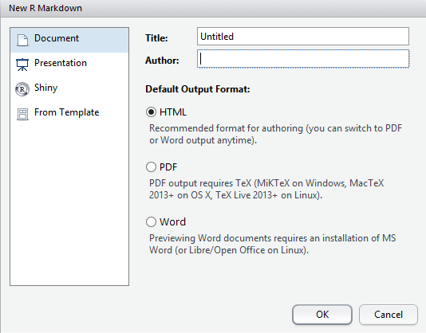

```{r, echo=FALSE, message=FALSE}
library(knitr)
library(tidyverse)
library(pander)
```


## R Markdown

### Writing Reports Using `rmarkdown`

* `rmarkdown` is a cohesive way to
    + Load & tidy data 
    + Add plain text section between code (i.e. no need for comments)
    + Analyse data, including figures & tables
    + Publish everything in a complete report/analysis
* Everything is one document, with our analysis code embedded alongside our results
* The package `knitr` is the engine behind this

*All practical sessions were written this way*

We can output our analysis directly as:

* HTML
* MS Word Documents
* PDF Documents ($\LaTeX$ installation required)
* Slidy or `ioslides` presentations

We never need to use MS Word, Excel or Powerpoint again!

The file suffix is `.Rmd`, and these files allow us to include normal text *alongside embedded `R` code.*.
An `rmarkdown` file can:

- Create all figures & tables directly from the data
- Include data, experimental and analytic descriptions
- Show mathematical equations
- Provide any other information

All output will be generated as a well-formatted, complete file, which can be simply re-generated at any time.


## Creating an *R* Markdown document

Let's create our first `rmarkdown` document

1. Go to the `File` drop-down menu in RStudio
2. New File -> R Markdown...


```{r, echo=FALSE, out.width = 534, fig.align = "center", results='asis'}

```

1. Change the Title to: My First Report
2. Change the Author to *your own name*
3. Leave everything else as it is & click OK
4. Save the file as `RMarkdownTutorial.Rmd`

### Looking at the file automatically created

There are quite a few features of note here.
Starting at the top, a *header section* is contained between the two sets of `---` lines on line 1 and line 6

- __Nothing can be placed before this section!__
- This section uses YAML (**Y**AML **A**in't **M**arkup **L**anguage)

Editing the YAML header is beyond the scope of this course, however using this we can set custom `.css` files, load LaTeX packages and control numerous output parameters

Immediately following the header (lines 8 to 10) is a code `chunk`

- Chunks always begin with ```{r}
- Chunks always end with ```
- Any code to be executed goes between these two delineators
- Chunk names are optional and directly follow the `r` (before any commas). These are highly advisable & can make it far easier to navigate through your document.
- Other parameters are also here, e.g. do we show/hide the code and this first line is often referred to as the chunk header.

Line 12 is a Section Heading, starting with `##`

- Click the _staggered text_ symbol in the top-right corner of the markdown document to open the _document outline_
- Chunk names can be shown here in _italics_. (Call a tutor if you can't see them. There's a setting in `Tools` > `Global Options` > `RMarkdown` that needs to be set.)
- Section Names appear in plain text

Check the help for a guide to the syntax.

`Help > Markdown Quick Reference`

- This describes the text formatting options: 
    + Bold is indicated by \*\*Knit\*\* (or \_\_Knit\_\_)
    + Italics can be indicated using a single asterisk/underline: \*Italics\* or \_Italics\_


### Compiling The Report

The default format is an `html_document` & we can change this later.
Generate the default document by clicking `Knit HTML`


A preview window will appear with the compiled report

- Note the hyperlink to the RMarkdown website & the bold typeface for the word **Knit**
- The *R* code and the results are printed for `summary(cars)`
- The plot of `temperature` Vs. `pressure` has been embedded
- The code for the plot was hidden using `echo = FALSE`

    
We could also export this as an MS Word document by clicking the small 'down' arrow next to the word `Knit`.
By default, this will be Read-Only, but can be helpful for sharing with collaborators.

Saving as a `.PDF` usually requires an installation of $\LaTeX$, so we'll ignore that for now.

### Making our own report

Now we can modify the code to create our own analysis.

- Delete everything in your R Markdown file EXCEPT the YAML header
- We'll analyse the `PlantGrowth` dataset which comes with `R`
- First we'll need to describe the data

```{r, eval=FALSE}
?PlantGrowth
```

#### Rename the report

First we should change the title of the report to something suitable, e.g. *The Effects of Two Herbicide Treatments on Plant Growth*

#### Create a ``Data Description" Section

Now let's add a section header for our analysis to start the report

1. Type `# Data Description` after the header and after leaving a blank line
2. Use your own words to describe the data

<details><summary><b>My example text was</b></summary>

> Plants were treated with two different herbicides and the effects on growth were compared using the dried weight of the plants after one month.
Both treatments were compared to a control group of plants which were not treated with any herbicide.
Each group contained 10 plants, giving a total of 30 plants.

</details>
<br>
Hopefully you mentioned that there were 10 plants in each group, with a total of 30.

__Can we get that information from the data itself?__

We know that the code `nrow(PlantGrowth)` would give the total number of samples.
__We can embed this in our data description!__

1. Instead of the number 30 in your description, enter \`r` nrow(PlantGrowth)`\`
2. Recompile the HTML document.

#### Loading *R* packages

1. Before the Data Description header, add a new header called `Required Packages`
2. Create a code chunk with the contents `library(tidyverse)`.
3. Recompile the HTML

**Hint: You can create an empty code chunk using** `Ctrl+Alt+I`

This has loaded all of the core `tidyverse` packages for all code chunks within the whole document.
All subsequent code chunks can now use any functions in these packages.

Notice that loading the `tidyverse` packages gave us an overly informative message.
We can turn this off by editing the chunk header.

1. After the `r` at the start of the code chunk, add a comma
2. Start typing the word `message` and use the auto-complete feature to set `message = FALSE`
3. Recompile

After our description, we could also have a look at the data in a summary.
Add the following in a code chunk.

```{r, eval=FALSE}
PlantGrowth %>% 
  group_by(group) %>% 
  summarise(n = n(), Mean = mean(weight)) 
```

(Recompile...)

#### Formatting Output

To change this table into a nicely formatted one, we can use the package `pander`

1. Load `pander` into the workspace by placing `library(pander)` below `library(tidyverse)`

Then head back to the code chunk and add the following.


```{r, eval=FALSE}
PlantGrowth %>% 
  group_by(group) %>% 
  summarise(n = n(), Mean = mean(weight)) %>%
  pander(caption = "Sample Sizes and average weights for each group")
```

(Recompile...)

The package `pander` is great for formatting `R` output as well, including vectors.
Add the following line to your data description:

> "The three groups are classified as \``r` `pander(levels(PlantGrowth$group))`\`"

<details><summary><b>What did levels(PlantGrowth$group) mean?</b></summary>
This column is considered by `R` to be a categorical variable.
`R` stores these as a data-type called a factor, and the different values it can take are known as `levels`.
Here we have three different categories (or treatments) which represent the control and two treatments.
<details>
<br>

#### Add a plot of the data

We can use `ggplot2` for this

1. This was already loaded with `library(tidyverse)`
2. Create a plot using `geom_boxplot()`
3. Fill the boxes based on the `group` variable


```{r, echo = TRUE, eval=FALSE}
ggplot(PlantGrowth, aes(x = group, y = weight, fill = group)) +
  geom_boxplot() +
  theme_bw() +
  labs(x = "Treatment Group", y = "Dried Weight (g)")
```

#### Analyse the data

Here we can fit a simple linear regression using:

- `weight` as the response variable
- `group` as the predictor variable

To fit a linear model in `R`:

1. Use the function `lm()`
2. Save the results as a new object

In the following line of code, we are saying the the `weight` measurements are dependent on the `group` each plant belongs to (`weight ~ group`).
In `R` we can usually read the `~` symbol as *depends on* (or *is a function of*).

```{r}
model_fit <- lm(weight ~ group, data = PlantGrowth)
```

We can view the `summary()` or `anova()` for a given model using this functions on the saved model.

```{r, results='hide'}
summary(model_fit)
anova(model_fit)
```

To place these as formatted tables in the text we can also use `pander()`, which has a default format setting for these types of objects.

```{r, eval=FALSE}
model_fit %>% summary() %>% pander()
```

```{r, eval=FALSE}
model_fit %>% anova() %>% pander()
```

You can change the default captions if you like using the argument `caption = "my caption"` inside the `pnder()` function.

#### Finishing the analysis

After you're happy with the way your analysis looks

- A good habit is to finish with a section called `Session Info`
- Add a code chunk which calls the `R` command `sessionInfo()`
- We can also wrap the output of `sessionInfo()` inside the `pander()` function to provide yet another nicely formatted section in our report.

So far we've been compiling everything as HTML, but let's switch to an MS Word document.
We could email this to our supervisors, or upload to Google docs for collaborators...

### Summary

This basic process is incredibly useful

- We never need to cut & paste anything between `R` and other documents
- Every piece of information can be drawn directly from our `R` analysis
- We can very easily incorporate new data as it arrives
- We can describe our code using either comments, or plain text in the surrounding paragraphs
- Creates *reproducible research*
