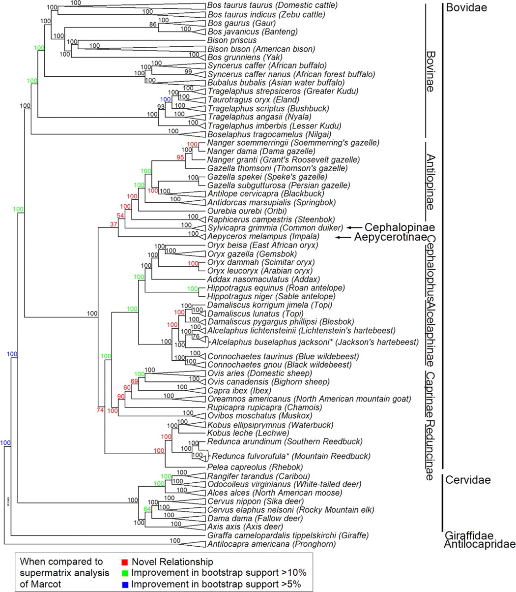

# Evolutionary Processes assignment (9/9/2018)

## Prepare the sequence data

Get the sequences from the [Biotech7005 repository](bovidea_118_mtDNA.fa).

### Reduced the size of the dataset

Run the following command using your student number for id:
```
./subset -id aXXXXXXX -n 50 -in bovidea_118_mtDNA.fa > bovidea_50_mtDNA.fa
```

(The subset command can be obtained from [here](subset).)

This selects 50 sequences from the input alignment according to your student number and writes them to a new file.
This is not normal practice, and is only necessary because of prac time limits.

### Multiple alignment

In order to construct a phylogenetic tree, we need to provide positional information to the tree reconstruction program so that related positions are comparable.
This is done by constructing a multiple sequence alignment.
There are many programs that can be used to do this; two fast programs are MUSCLE and MAFFT

Run the following commands:

```
mafft bovidea_50_mtDNA.fa > bovidea_50_mtDNA-mafft.fa
```

### Remove non-conserved blocks

Many programs unfortunately have name length limitations.
One of the programs we will be using (Gblocks) cannot have long sequence identifiers and is not open source, so we cannot fix it.
To get around this problem we will shorten the identifiers in a meaningful way.

Run the following command to change the sequence IDs:
```
sed -e 's/^>[^ ]\+ \([^ ]\+\) \([^ ]\+\).*$/>\1_\2/g' bovidea_50_mtDNA-mafft.fa > bovidea_50_mtDNA-named.fa
```

**What does this command do?**

In order to be able to examine the alignments more effectively we will convert the format from FASTA to NEXUS format. This will make it easier to see the alignment.

```
seqmagick convert --output-format nexus --alphabet dna bovidea_50_mtDNA-named.fa bovidea_50_mtDNA-named.nex
```

Look at the NEXUS alignment file. At the beginning of the alignment and near the end there are regions that have large gaps and very poor conservation.

**What is the reason for this? (*Hint: use the accession numbers in the name to search [Entrez](https://www.ncbi.nlm.nih.gov/genome/) for the annotation.*)**

The phylogenetic reconstruction methods we will be using cannot handle missing bases, so these must be removed. 
We can use Gblocks to remove the non-conserved regions of the alignment.
Gblocks can be obtained from [here](http://molevol.cmima.csic.es/castresana/Gblocks/Gblocks_Linux64_0.91b.tar.Z); use `wget` to get the program.
Extract the program by executing `tar xaf Gblocks_Linux64_0.91b.tar.Z` and then run it by entering `Gblocks_0.91b/Gblocks`.
Use the menu options in the program to remove the non-conserved regions from the `fa` file (not the `nex` file).
This will give you a file `bovidea_50_mtDNA-named.fa-gb`.

**Why do we need to do this? (*Hint:read the [Gblocks documentation](http://molevol.cmima.csic.es/castresana/Gblocks.html)*)**

### Convert to NEXUS format

The program we will be using to perform phylogenetic reconstruction uses a sequence (and other character) format called NEXUS.
The NEXUS format is fairly widely used for phylogenetic data as it can be used to encode a variety characters, not limited to sequence data.

Use `seqmagick` to convert the `fa-gb` file to a nexus format with the name `bovidea_50_mtDNA-named.nex`.
Note that you will need to rename the `fa-gb` file so that it has an `fa` file extension.

## Run Mr Bayes

Mr Bayes is a program for performing phylogenetic tree reconstruction from multiple sequence alignments using a Bayesean inference.
The Bayesean approach to reconstruction is based on using a likelihood function to estimate posterior probabilities for trees and model parameters.
There are concerns in the literature about the validity of Bayesean reconstruction, but Mr Bayes provides a good environment to do the practical and Baysean inference works for many data sets.

A manual for Mr Bayes is available from [here](http://mrbayes.sourceforge.net/mb3.2_manual.pdf).

Start Mr Bayes by entering the following command into a terminal:

```
mb
```

This will give you a Mr Bayes prompt that should look like this.


```

                            MrBayes v3.2.6 x64

                      (Bayesian Analysis of Phylogeny)

              Distributed under the GNU General Public License


               Type "help" or "help <command>" for information
                     on the commands that are available.

                   Type "about" for authorship and general
                       information about the program.


MrBayes > 
```

If you enter `help` at the prompt you will get a list of topics that can be read, for example `help execute`.


### Load sequence data

First you will need to load the data set that you prepared.

Use the `execute` command to load the NEXUS sequence file you created with seqmagick.

**How many taxa were read into memory? How many characters are being used?**

### Set options

For the practical you are to perform 2 reconstructions, choosing from substitution models with 1, 2, 6 or mixed.
Each run takes about an hour, so you will have time to work on other parts of the practical while it is running.

First you need to set the number of substitution rate parameters used in the model.
Before you do this, see what the values of parameters are by default in the likelihood setting.

```
help lset
```

You can see that the default rate matrix is 4 by 4 which corresponds to nucleotide.

**What substitution models does the default number of substitution types correspond to?**

Set the number of substitution types to the number you have chosen (written below as `<num>`).

```
lset nst=<num>
```

### Run Monte-Carlo Markov Chain analysis

The next thing to do is start the tree reconstruction analysis.
This is done using the `mcmc` (Markov chain Monte Carlo) command.
Before you do this, you will need to set some options.
First examine the defaults.

```
help mcmc
```

You can see here that the default analysis runs for 1,000,000 iterations, retaining every 500th iteration for tree reconstruction.
You can also see that the first 25% of samples are discarded by default.

We don't have enough time to run for 1e6 generations, we want to see the convergence behaviour and we want to specify the output file name (again `<num>` is the model subtitution type number), so start the analysis with the following command.

```
mcmc ngen=50000 relburnin=no burnin=0 filename=model-<num>
```

This will take some time (the remaining time is shown to the right of the output).
You will see in the output the log likelihoods of the trees being considered (2 runs by 4 chains) in the analysis, and every 5 lines the variance between the two runs is output to give an indication of how far the trees have converged.
You can see that as the run continues the average standard deviation of split frequencies decreases, showing that the two runs are converging on the same tree or similar trees.

### Examine convergence

After the MCMC has completed the 50,000 iterations, it will output the final average standard deviation of split frequencies and ask if the run is to be continued.
Answer "no".

See the Mr Bayes [tutorial](http://mrbayes.sourceforge.net/wiki/index.php/Tutorial#When_to_Stop_the_Analysis) for a more complete explanation of how to decide the answer to this question.

When you stop the runs, Mr Bayes will output summary data from the analysis.

To look at the convergence, execute the following command.

```
sump
```

**Describe what the output graph shows.**

Find where the plateau starts by choosing different burnin lengths (note that the burnin describes the number of leading sample to discard, not the number of MCMC iterations).

**Approximately when does the plateau start in terms of number of samples?**

### Examine trees

When you are happy with the burnin - that the log likelihood has pateaued - you can get the consensus tree to be calculated.

```
sumt
```

This will output a large quantity of data about the estimated paramaters and the statistical support for branch nodes, and two trees, one showing the consensus branch lengths and one showing the branch node support.
It will also output a consensus tree file called "model-\<num\>.con.tre".

Repeat the analysis with another model and compare the trees using the [Archeopteryx program](https://sites.google.com/site/cmzmasek/home/software/archaeopteryx).

**Do the trees from the two models differ? How does the branch support differ between the two trees? Do the trees agree with the known taxonomic groupings?**

#### Nuclear tree from Decker *et al.* 2009 doi:[10.1073/pnas.0904691106](https://doi.org/10.1073/pnas.0904691106)



## Tasks (due 7/9/2018)

### Practical questions

Answer the questions in **bold** above.

### Bayesean Trees with whole mitochondrian genomes

Produce a Bayesean tree for the whole mitochondrial genome of Marsupials.
These genomes can be obtained from [here](https://www.ncbi.nlm.nih.gov/genome/browse#!/organelles/) with a search of "metatheria".
The NC\_nnnnnn.1 links in the "Replicons" column link to the sequence pages.
In the sequence page, use the "Send to" menu to send to a file as FASTA (you will want to do this on the virtual machine).
When you have all the sequences, concatenate them with the `cat` command to a multiple FASTA file.
An alternative is to use [this program](fetch) (you will need to `chmod +x` to get it to work and will also need to curate the sequences since a number of species are represented more than once).
If you use `fetch`, you need to invoke it as `fetch -email <youremailaddress> -out <outfile>`, otherwise the sequence will be dumped to the screen.

1. What two species are the best to use as an outgroup?
2. Which two leaves are the closest related/have the shortest branch? What is the evolutionary distance between these two leaves?
3. Which of the following two species are more closely related?
    1. silky-shrew oppossum
    2. Tasmanian wolf
    3. koala
    4. platypus

