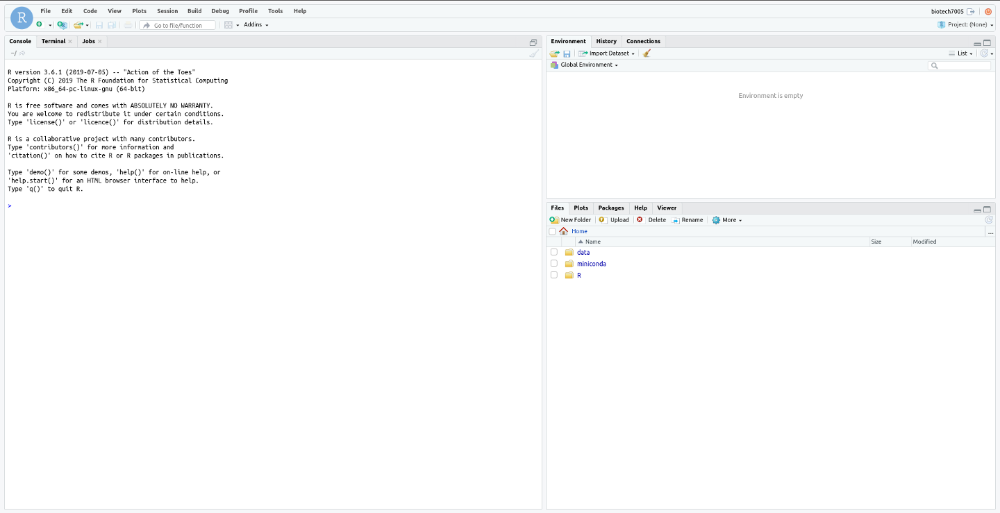

# Connecting to your VM

You will have each been given a VM which we access using the IP address you have been assigned.
All VMs are the same and we will use these for the entire practical series.

**Follow all instructions here very, very carefully**

1. Open your favourite internet browser. We recommend Firefox, but Chrome is also acceptable. Safari and Edge are discouraged.
2. Enter your given IP address (10.150.x.xx) in the address bar of your browser, but follow these numbers with `:8787`. (RStudio has been set to broadcast on the port 8787)
3. Login with the username `biotech7005`. The username is also your initial password.

Now you should see the following image:

**Reset your password**

As we have all been given the same password, we need to reset this to ensure no-one else can log into our VM.
To do this we're going to briefly use another language known as `bash` which we'll introduce in more detail at a later point in this course.

**Follow all instructions here very, very carefully**

1. Inside RStudio *click the Terminal* tab at the top left. You will see something like `biotech7005@2019-biotech7005:~$` with a cursor flashing and indicating you can type here.
This is also known as the prompt.
2. Type the command `passwd` followed by <kbd>Enter</kbd>
    - You will now be asked to enter your existing password. NOTE THAT WHEN ENTERING YOUR PASSWORD **NO TEXT WILL APPEAR AT THE PROMPT**. This is a security feature.
    - Enter a new password. Again, *you will not see any characters appear*.
    - Re-enter your new password to confirm you haven't made any typos. (If you do make a mistake, the process will abort, so just begin again by typing `passwd` + <kbd>Enter</kbd>)
    - **PLEASE REMEMBER THIS PASSWORD**
3. At the top right of RStudio, next to `biotech7005`, click the logout () symbol.
4. Login once again using your new password.

You now have access to your VM.
Importantly, you will only be able to access your VM:

- When connected directly to the University WiFi Network
- When connected from another network using the [University of Adelaide VPN](https://www.adelaide.edu.au/technology/your-services/network-services/remote-access-via-virtual-private-network-vpn)

[Back](R_Practicals/1_Introduction_To_R)