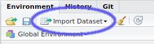
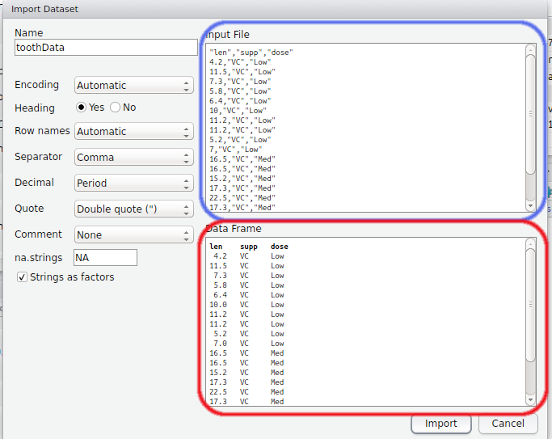

```{r setup, include=FALSE}
knitr::opts_chunk$set(echo = TRUE, include = TRUE, 
                      warning = FALSE, message = FALSE, 
                      out.width = 800, fig.align = "center")
```

```{r loadPackages, echo=FALSE}
library(knitr)
```


## Loading Data
We can load data into *R* using some more built-in functions, and by default *R* imports each file as a `data.frame`.
*R* expects to see some kind of delimiter it can use to make columns, and these can be:

1. commas (e.g. a .csv file)
2. tabs (e.g a .tsv file)
3. spaces
4. semi-colons, or whatever was used to create the file.

Fortunately RStudio helps us do this by providing the "Import Dataset" button.



Let's load the dataset `toothData.csv` which is in the `data` directory.

1. Click the Import Dataset button, then `From Text File...`
2. Navigate to the `data` folder
3. Select the file `toothData.csv`

Now a preview screen has appeared, with numerous options.



1. The top section (blue) contains a preview of the raw data file
2. The bottom section (red) contains the `data.frame`as it would appear in *R*.
3. On the LHS we have numerous options for the data. 
    + Do we have column names (i.e. a heading)?
    + Do we have row names?
    + What is the delimiter?
    + What value should *R* give to missing values?
    + Should any text columns be converted to a `factor`?
  
**Try changing a few to see what effect they have on the** `data.frame` **preview**

Now load the data, unchecking the `Strings as factors` box, and two lines of code will appear in your console.
The second line of your code `View(toothData)` was entered by the GUI and will have made a preview frame of your data appear, just like a spreadsheet.
We can use the function `View()` to inspect an R object anytime, although large objects will be truncated.
Files with many rows or columns clearly place huge demands on your memory, and there is no pratical advantage to looking at these using this method.

**Two important points**

1. Using the GUI to import data will give the *R* object, the same name as the file name, i.e. `toothData`
2. Notice that this has generated two lines of code. If using this method, **ALWAYS COPY THE FIRST LINE** to your R script. This contains actual code the GUI used to load your dataset, and just re-running this line will always perform the exact same action. 

In our sample code, we should see  
`toothData <- read.csv("path/to/data/toothData.csv", stringsAsFactors = FALSE)`.
(NB: `path/to/data/` will actually be different for all of you, depending on where you saved the file.)
Notice that this will have loaded the data, treating the character strings as character strings, instead of categorical variables.

## Loading Data Without Using a GUI
We can also load data, using the functions `read.csv`, `read.table` or `read.delim`.
The code generated by the GUI will have used one of these.

```{r,eval=FALSE}
?read.table
```

All of the options we saw on the LHS of the GUI are listed here as function arguments.
Note that for `read.csv` there are default values set such as `header=TRUE`, `sep=","`.
Using these defaults, we could have also loaded the file using the following command.
(Remember to put in the correct directory path for your computer instead of `path/to/data`).

```{r, echo=FALSE}
toothData <- read.csv("data/toothData.csv", stringsAsFactors=FALSE)
```


```{r, eval=FALSE}
toothData <- read.csv("path/to/data/toothData.csv", stringsAsFactors = FALSE)
```

## Manually setting factor levels

When converting character strings to factors, *R* will automatically set the category levels in alphabetic order.
Setting these manually can often be preferable, so let's convert the columns `supp` and `dose` to factors.
If we are happy with the default alphabetic order, we can simply use:

```{r}
toothData$supp <- as.factor(toothData$supp)
```

However, if we wish to specify these in non-alphabetic order we can set the category order using

```{r}
toothData$dose <- factor(toothData$dose, levels=c("Low", "Med", "High"))
```
Notice that in both of the above lines of code, we overwrote the original columns of data in the *R* object `toothData`.

