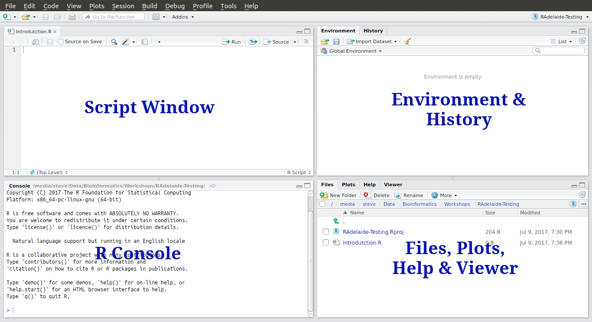
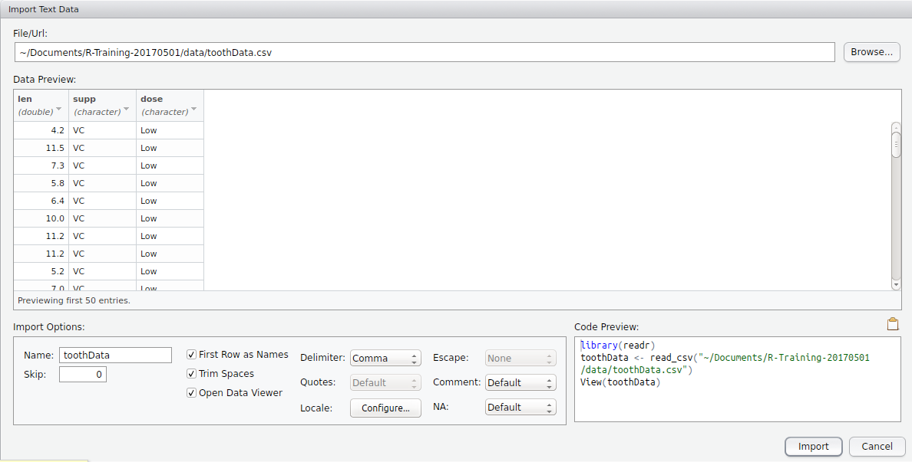
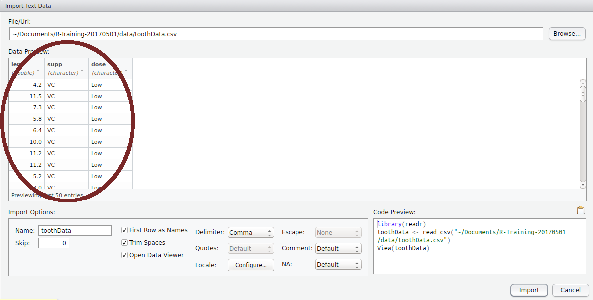

```{r, echo = FALSE}
library(knitr)
opts_chunk$set(echo = TRUE,
               eval = FALSE,
               message = FALSE, warnings=  FALSE)
```


# Introduction

## Introduction to R

### What is R?

- R is an interactive language which can be executed in real-time, or run as a stand-alone script
- Can be run on an HPC, or locally (on your laptop)
- Can be run from the terminal (Mac/Linux), stand-alone (Windows) or inside an Integrated Development Environment (IDE) on all platforms
- Grew from the statistical language `S` (Bell Labs, 1976)
- One of the most widely used languages in biological research

### Why use R?

R offers numerous advantages over Excel, GraphPad Prism & the like:  

- Can handle extremely large datasets  
- We can perform complex analytic procedures
- Many processes come as inbuilt functions  
- **We have code to record and repeat our analysis**

### Installing R

Please follow instructions for your OS, and install `R` on your laptop.
Only install R. 
We will install RStudio next.

- [Ubuntu](install/ubuntuInstall.md)
- [OSX](install/osxInstall.md)
- [Windows](install/windowsInstall.md)

### Running R

Let's have a quick look at R in it's simplest form.

- OSX/Ubuntu users: Open a terminal and type `R`
- Windows users: Open the program `R`

This is the `R` Console and we can use this as a simple calculator, as well as for executing complex code.
Enter the following in the console, followed by `Enter`

```{r, eval = FALSE}
1 + 1
```

Mess around with a few more simple calculations, then exit `R` by typing `q()`.
When asked to save the Workspace image, choose `n`.

## Introduction to R Studio

Now continue the instructions to install `R Studio Desktop`, then open `R Studio`.
This is the way we usually interact with `R` on our laptop or desktop computers.

### Starting with R Studio: Creating an `R Project`

First we will set up an `R Project` for today's practical.
These are a simple way of managing your code for multiple analyses or datasets, and are always named after the directory they are in.
They're not essential, but are very useful.

1. Create a folder on your computer for the practical material
    + We recommend `Practical_1` in an appropriate folder
    + Create a sub-folder called `data`
2. `File` > `New Project` > `Existing Directory` >
    + Browse to `Practical_1`
    + `Create Project`


### Starting with R Studio: Creating an `R Script`

Next we'll create a blank `R Script`.
These are just plain text files we use to save our code.

1. `File` > `New File` > `R Script`
2. Save As `Introduction.R`

Your screen should now look like the following:

```{r, echo = FALSE, include=TRUE, eval = TRUE, results='asis', fig.show='asis', out.width=900, fig.cap="The common RStudio layout"}

```


### The Script Window

- This is just a text editor.
- We enter our commands here but they are not executed
    - We can keep a record of __everything__ we've done
    - We can also add comments to our code
    - Comments start with the `#` symbol
- We'll return here later

### The R Console

- Where we can execute commands directly, as we've already seen
- This is essentially the _"engine"_

```{r}
1 + 1
2 * 2
```

As well as performing simple calculations:

- `R` has what we call an `Environment` (i.e. a Workspace)
- We can define objects here, or import data
   - Like a worksheet in Excel, but **much more** flexible & powerful
- `R` performs calculations & runs processes on these objects

To create an `R` object:

- We need to give it a name, and some data
- The process looks like `nameOfObject <- data`
    - The `<-` symbol is like an arrow
    - Tells `R` to put the `data` in the object

In the Console type:

```{r}
x <- 5
```

- We have just defined an object called `x`
- View the contents of the object `x` by entering it's name directly in the `Console`, or by calling `print()`

```{r, echo=TRUE, include=TRUE, results='hide'}
x
print(x)
```

**Where have we created the object `x`?**

- Is it on your hard drive somewhere?
- Is it in a file somewhere?

### The R Environment

We have placed `x` in our `R Workspace`, which is more formally known as your `Global Environment`.

```{r, echo=FALSE, include=TRUE, eval = TRUE, out.width=600}
knitr::include_graphics("images/EnvironmentTab.png")
```

The `Environment` is like your desktop. 
We keep all our relevant objects here and can save all the objects in your workspace as a single `.RData` object.

In the R Environment, we can create objects of multiple types.
Once an object is in the `Environment` we can perform calculations on it.
Using the object `x` we created as an example:

```{r}
1 + x
x^2
```

**NB: R is *case sensitive**

### Functions

`R` has a series of inbuilt functions, e.g. `sqrt()`, `log()`, `max()`, `min()` etc. loaded into your Environment.
We place an object or value inside the `()` after the name of a function

```{r}
sqrt(x)
log(x)
```

Many inbuilt functions are organised into a package called `base`

- Always installed with `R`
- Packages group similar/related functions together
    
```{r, eval=FALSE}
?base
```

This will take you to the `Help` pane.
Click on the underlined word `Index` at the bottom for a list of functions in the `base` packages

### The Script Window

Best practice for all analysis is to enter every line of code in the Script Window

- This is a plain text editor $\implies$ `RStudio` will:
    - highlight syntax for us
    - help manage indenting
    - enable auto-completion (it's glitchy though)
- Enter code in this window and *send it to the R Console*    
- We save this file as a record of what we've done

When writing code

- We can write comments by starting a line with the `#`
    - Anything following this symbol will not be executed
    - Can write notes to ourselves and collaborators
    - We can also place this at the end of a line with a comment
- Enter the following in the Script Window (but don't do anything else)

```{r}
# Create an object called x
x <- 5
```

To send this to the Console:

- Place the cursor on a line then `Ctrl+Enter` (`Cmd+Enter` on OSX), or
- Select the lines using the mouse then `Ctrl+Enter` (`Cmd+Enter` on OSX)
- Or after selecting the line(s) you can click the `Run` button

As well as creating objects, we can use this to write general code

```{r}
# I'm not sure. Is this greater than zero?
x > 0
```


### Other Features

#### Tab Auto-completion

`RStudio` will give us suggestions when we ask it to.

- In either the Console or Script Window type `?bas` then hit the `<tab>` key
    - A whole lot of options will appear
    - Very handy with long variable/function names
    - If you can't quite remember the spelling
    - Can sometimes (inappropriately) complete when you don't want it to

#### The History Tab

- Next to the `Environment` Tab is the `History` Tab
    - Contains everything executed in the `Console`
    - Useful for when we've been lazy
- Best coding practice is to **enter code in the `Script Window` and execute**

#### Other Tabs

In the bottom right are a series of tabs

1. `Files`: This shows your current working directory
2. `Plots`: Every time you make a graph it appears here
3. `Packages`: __NEVER CLICK OR UN-CLICK ANYTHING HERE__
4. `Help`: We'll use this a lot!

- Every tab can also be resized using the buttons in the top right
- Window separators can also be be moved

```{r, echo=FALSE, eval=TRUE}
opts_chunk$set(include = TRUE,
               eval = TRUE,
               fig.show = 'asis')
```


# Loading Data Into R

## Importing Data

A stumbling block for many learning `R` is the __Error Messages__, and these are often seen while we're loading data.
Like most programming languages `R` is very strict about data formats.
We can load `.xlsx`, `xls`, `csv`, `txt`, `gtf/gff` files + many more, but understanding the structure of the spreadsheet is vital

Some things we do to make it "look nice" in Excel can create problems:

- Merged cells can lead to errors and unexpected results
- Specifying missing values can give misleading values
- Blank rows are not fatal, just annoying
- Cell formatting such as colour, fonts and cell-size will not be imported
- Plots will not be imported

**Before We Go On**

We first need to create a new script for this section.
Save and close the first script we used, then create a new one

1. `File` > `New File` > `R Script` (Or `Ctrl+Shift+N`)
2. Save as `DataImport.R`
3. Enter this line at the top of the script

```{r}
library(dplyr)
```

Once you've entered this in your script, send it to the console using one of the above methods.
This will load the package `dplyr`, which contains many useful functions for the following section.

A common (and strongly advised) practice is to place all of your `library()` commands at the top of your script.
This will be helpful for any collaborators, and for yourself when you look back at a script in 6 months.


## Using the GUI To Load Data

1. Navigate to your `data` folder using the `Files` Tab.
2. Click on the file `toothData.csv`
3. Select `View File`

This can be used to open (small) files in the `Script Window` and view them as plain text files.
When doing this **the file is not loaded into R**.
However, it can be useful just to have a quick look at what the file contains.

Now close the file again.

To import the file, or more accurately, to import the data within the file into our `R Environment` we can either:

1. Click on the file and choose `Import Dataset`, or
2. Use the button as shown in the `Environment` Tab


This will open the **Preview Window** as seen below

```{r, echo = FALSE, out.width = 900, fig.cap = "The Preview Window as part of the Import Data GUI."}

```

As highlighted in the circle, this gives us a preview of the data as `R` will see it.
This is helpful to check that the columns are as we expect.
If there are problems with delimiters (sometimes files can be labelled `.csv` files but use a tab or semi-colon as delimiters) we will spot the problem here.
If the column names are not as expected, we can also spot any problems here.

```{r, echo=FALSE, out.width='900mm', fig.align='center', fig.cap = "The Preview Window showing where we can see a preview of the data."}

```

A very important frame in this preview is the code highlighted in the bottom right corner.
This is the `R` code that is being executed to import the data.
Highlight this code with your mouse/touchpad and copy it to your clipboard.

```{r, echo=FALSE, out.width='900mm', fig.align='center'}
knitr::include_graphics("images/importGUI_code.png")
```

Once you have copied this code, click `Import` and the data will pop open inside `RStudio`.
Before you go any further, go to your `DataImport.R` script and paste the code directly below the line `library(dplyr)`.

### Undertanding the Executed Code

The code we copied has 3 lines:

1. `library(readr)`
    + The package `readr` contains the function `read_csv()`
2. `toothData <- read_csv("~path/to/data/toothData.csv")`
    + This is the code executed to load the data into your `R Environment`
    + It created an object named `toothData` by using the file name.
    + The location of the file on your hard drive was passed to the function
3. `View(toothData)` opened a preview in a familiar `Excel-like` format
    + I never use this
    + Edits in here will not affect the main `R` object, and only affect this preview 
    + Close the preview by clicking the cross and delete `View(toothData)` from your lines of code

We have just loaded data using the default settings of `read_csv()`.
(If we'd change any options in the GUI, the code would have changed.)
Now we've saved the code in our script, we don't need the GUI for this operation again.

To demonstrate this:

1. In the `Environment Tab` click the broom icon ()
    + This will delete everything from your `R Environment`
    + It won't unload the packages `dplyr` or `readr`
2. Select the code we've just pasted and run it (Reloading the packages won't hurt anything)
3. Check the `Environment Tab` again and `toothData` is back

**Reproducible Research!!!**

### Understanding `read_csv()`

In the above we called the `R` function `read_csv()`.
We can check the help page by typing a `?` followed by the function name (no spaces)

```{r, eval = FALSE}
?read_csv
```

This page lists four functions but stick to `read_csv()`
This function has numerous arguments given with names like `file`, `col_names` etc.

- If just the name is given in the function (e.g. `file`), we need to specify something or the function will not know what to do
- For any *argument* which is given a default value (e.g. `col_names = TRUE`), the function has a default value and we don't need to specify anything, unless over-riding the defaults.
- **If specifying arguments in order, we don't need to name them**
- All `arguments` for the function were defined somewhere in the GUI

For example:

```{r, eval=FALSE}
toothData <- read_csv("data/toothData.csv")
```

Is equivalent to:

```{r, eval=FALSE}
toothData <- read_csv(file = "data/toothData.csv")
```

**If we had a file with 3 blank lines to start, what could our code look like?**

Setting the argument `skip = 3` would then tell `read_csv()` to ignore the first 3 lines.

```{r, eval=FALSE}
toothData <- read_csv("path/to/file", skip = 3)
```

**What do you think the argument `trim_ws` does?**

```{r}
opts_chunk$set(eval = FALSE)
```


### Working with Files

We often have to load data into `R` from a file on our computer, and as many of us know, Windows uses the `\` symbol to separate directory names.
OSX and Linux use the `/` symbol, so `R` has a convenient function called `file.path()` which is able to decide which separator to put there.
This can often be a useful way to pass file paths to a function such as `read_csv()`.

```{r}
toothFile <- file.path("data", "toothData.csv")
toothFile
```

Depending on your OS, this will give different results.

Once we've defined the path to a file as an `R` object, we can also check to see if the file exists, and to make sure we have the path correct.

```{r}
file.exists(toothFile)
```

Thus an experienced bioinformatician may write the original importing code as:

```{r}
library(dplyr)
library(readr)
toothFile <- file.path("data", "toothData.csv")
file.exists(toothFile)
toothData <- read_csv(toothFile)
```

## Data Frame Objects

The object `toothData` is a `data.frame` object (it's actually a variant called a `data_frame` or `tibble` which is a `data.frame` with pretty wrapping paper). 
This is the `R` equivalent to a spreadsheet and the main object type we'll work with for the next two weeks.
Three possible ways to inspect this using the Console are:

```{r,eval=FALSE}
View(toothData)
toothData
head(toothData)
```

**What were the differences between each method?**

*NB: There is another `R` function called `read.csv()` which uses an older import method.*
This function obviously still works, but is more difficult to work with than `read_csv()`

If the object `toothData` was a `data.frame` instead of a `tibble`, when we'd entered the object name `R` would have dumped all the content of the object onto the screen, instead of just showing us the first few rows.
This is one of the advantages of using `read_csv()` instead of `read.csv()`, as our objects can often be thousands of lines lone.
The older `read.csv()` function loads data as a `data.frame` which is less convenient than the `tibble` objects formed by `read_csv()`.


# Data Cleaning and Manipulation

**What if the data we have isn't nice?**

- Missing values might be given an actual value (e.g. 9999, "NA")
- Column names might be missing
- File may have comments throughout
- May be structural errors in the file such as different column numbers or different column separators
- White-space in cells

## Importing Data

### Loading Files With Comments

Many files have comments embedded within them, and these often start with symbols like `#`, `>` or even `_`.
We can specify the comment symbol in the argument `comment =` which tells `read_csv()` to ignore lines which begin with these characters.
We'll return to this idea later.

### Missing values

### Dealing With Column Names

By default `read_csv()` assumes the names of the variables/columns are in the first row (`col_names = TRUE`).
This row is used to tell `R` how many columns you have.

**What happens if we get this wrong?**

```{r}
no_header <- read_csv("data/no_header.csv")
```

We can easily fix this

```{r}
no_header <- read_csv("data/no_header.csv", col_names = FALSE)
```

**What about that first column?**

That first column looks like it's just row numbers, which are unnecessary in R, as they are automatically included in `data.frame` (and `tibble`) objects.
We can specify what is loaded or skipped using `col_types`

```{r}
no_header <- read_csv("data/no_header.csv", col_names = FALSE,
                      col_types = "-ccnnc")
```

**What if we get that wrong?**

Let's mis-specify the third column as a number instead of a text-string, i.e. "character"

```{r}
no_header <- read_csv("data/no_header.csv", col_names = FALSE,
                      col_types = "-cnnnc")
```

**Did the error message make any sense?**

**Did the file load?**

**What happened to the third column?**

### Dealing With Comments

Let's get it wrong first

```{r}
comments <- read_csv("data/comments.csv")
```

**What happened when we loaded this data?**

Now we can get it right by telling `read_csv()` to ignore any rows beginning with `#`

```{r}
comments <- read_csv("data/comments.csv", comment = "#")
```


### Structural Problems

What happens when you try to load the file `bad_colnames_.csv`

```{r}
bad_colnames <- read_csv("data/bad_colnames.csv")
```

**What has caused this?**

Here's my solution, where I've set the column names manually.

```{r,tidy=TRUE}
bad_colnames <- read_csv("data/bad_colnames.csv",  skip =  1, col_names = FALSE)
colnames(bad_colnames) <- c("rowname", "gender", "name", "weight", "height", "transport")
```

There are two new concepts here.

1. We can use the function `colnames()` to call the column names, or if we follow the function with the assignment operator `<-`, `R` will place the subsequent data into the column names of the `data.frame`
2. The second is the use of the function `c()`, which is one of the most common functions in `R`.
This stands for `combine`, and combines all values within the brackets `()` into a single `R` object, or `vector`.
If left empty, it is equivalent to `NULL`

```{r, results='markup'}
c()
```

We'll see this function a great deal when using `R`.

### Encoded Missing Values

**What if missing values have been set to "-" or some other value in our csv file?**

Let's get it wrong first:

```{r}
missing_data <- read_csv("data/missing_data.csv")
```

**Where have the errors appeared?**

Now we can get it right:

```{r}
missing_data <- read_csv("data/missing_data.csv", na = "-", col_types = "-ccnnc")
```

